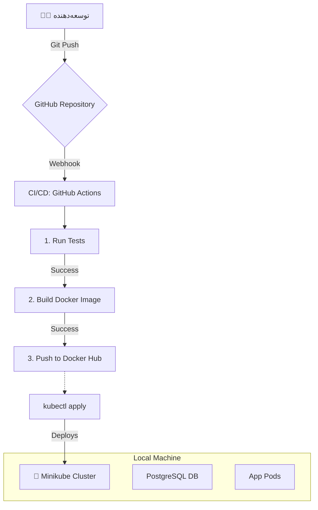

# پلتفرم ارتباطات داخلی تیم‌ها

این یک پروژه‌ی محصول-محور برای نمایش مفاهیم و ابزارهای DevOps است. هدف، ساخت یک پلتفرم ساده برای چت، ارسال فایل و مدیریت وظایف و پیاده‌سازی کامل چرخه‌ی CI/CD و مانیتورینگ برای آن است.

## معماری پروژه (نسخه لوکال)

این دیاگرام، چرخه‌ی کار در محیط توسعه‌ی لوکال را نشان می‌دهد:

## تکنولوژی‌های مورد استفاده

- **اپلیکیشن:** (هنوز مشخص نشده)
- **کانتینرسازی:** Docker
- **ارکستراسیون (لوکال):** Minikube / Kubernetes
- **CI/CD:** GitHub Actions
- **مانیتورینگ:** Prometheus & Grafana
- **زیرساخت به عنوان کد:** Docker Compose (برای توسعه)

## راهنمای راه‌اندازی

(در آینده تکمیل می‌شود)